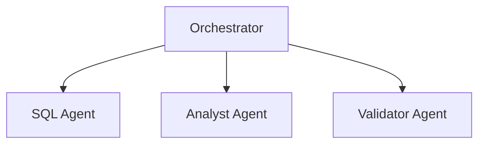

# Multi-Agent System

Build complex workflows with multiple agents.

---

## Available Agents

| Agent | Purpose |
|-------|---------|
| [SQL Agent](sql-agent.md) | Text-to-SQL conversion |
| Analyst Agent | Result analysis |
| Validator Agent | Security validation |

---

## Architecture



---

## Quick Start

```python
from src.core.orchestrator import AgentOrchestrator

orchestrator = AgentOrchestrator()
orchestrator.register_agent("sql", sql_agent)
orchestrator.register_agent("analyst", analyst_agent)
```
