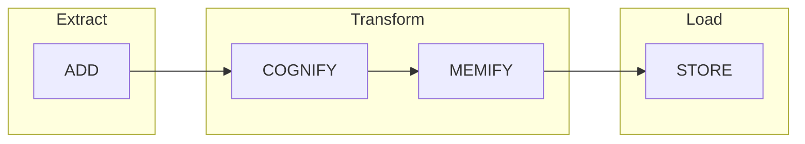

# Memory Manager

Hybrid memory system for persistent knowledge.

---

## MemoryManager

### Constructor

```python
from src.memory.manager import MemoryManager, MemoryConfig

manager = MemoryManager(
    config: MemoryConfig,
    graph_store: Optional[MemoryStore] = None,
    vector_store: Optional[MemoryStore] = None,
    sql_store: Optional[MemoryStore] = None,
    embedding_fn: Optional[Callable] = None,
)
```

### MemoryConfig

```python
from src.memory.manager import MemoryConfig

config = MemoryConfig(
    enable_graph: bool = True,           # Graph relationships
    enable_vector: bool = True,          # Semantic embeddings
    enable_sql: bool = True,             # Structured persistence
    vector_dimensions: int = 1536,       # Embedding size
    similarity_threshold: float = 0.7,   # Search threshold
    max_memories_per_query: int = 10,    # Results limit
    memory_ttl_days: int = 90,           # Expiration
    enable_compression: bool = True,     # Compress long content
    enable_deduplication: bool = True,   # Prevent duplicates
    consolidation_interval_hours: int = 24,
)
```

---

## MemoryType

```python
from src.memory.manager import MemoryType

MemoryType.CONVERSATION     # Chat history
MemoryType.ENTITY_FACT      # Facts about entities
MemoryType.SCHEMA           # Database schema
MemoryType.QUERY_PATTERN    # Successful SQL patterns
MemoryType.ERROR_PATTERN    # Error patterns to avoid
MemoryType.USER_PREFERENCE  # User preferences
MemoryType.SEMANTIC         # General knowledge
```

---

## MemoryPriority

```python
from src.memory.manager import MemoryPriority

MemoryPriority.CRITICAL  # Always retrieve (1.0)
MemoryPriority.HIGH      # Important (0.8)
MemoryPriority.MEDIUM    # Normal (0.6)
MemoryPriority.LOW       # Background (0.4)
```

---

## Methods

### add()

<div class="api-method" markdown>

```python
async def add(
    content: str,
    memory_type: MemoryType,
    entity_id: Optional[str] = None,
    process_id: Optional[str] = None,
    session_id: Optional[str] = None,
    metadata: Optional[Dict] = None,
    priority: MemoryPriority = MemoryPriority.MEDIUM,
) -> Memory
```

</div>

Add raw content to memory (Extract phase).

#### Example

```python
memory = await manager.add(
    content="SELECT COUNT(*) FROM users WHERE active = true",
    memory_type=MemoryType.QUERY_PATTERN,
    metadata={"question": "How many active users?", "success": True},
    priority=MemoryPriority.HIGH,
)
```

---

### cognify()

<div class="api-method" markdown>

```python
async def cognify(memory: Memory) -> Memory
```

</div>

Transform content into structured knowledge (Cognify phase).

- Generates embeddings
- Extracts entities
- Finds relationships

```python
memory = await manager.cognify(memory)
```

---

### memify()

<div class="api-method" markdown>

```python
async def memify(memory: Memory) -> Memory
```

</div>

Enrich memory with computed properties.

- Calculates relevance scores
- Compresses if needed

```python
memory = await manager.memify(memory)
```

---

### store()

<div class="api-method" markdown>

```python
async def store(memory: Memory) -> bool
```

</div>

Persist memory to storage backends (Load phase).

```python
success = await manager.store(memory)
```

---

### ingest()

<div class="api-method" markdown>

```python
async def ingest(
    content: str,
    memory_type: MemoryType,
    **kwargs,
) -> Memory
```

</div>

Complete ECL pipeline: Add → Cognify → Memify → Store.

```python
memory = await manager.ingest(
    content="Users table: id, name, email, created_at",
    memory_type=MemoryType.SCHEMA,
    metadata={"table": "users"},
)
```

---

### search()

<div class="api-method" markdown>

```python
async def search(
    query: str,
    memory_type: Optional[MemoryType] = None,
    entity_id: Optional[str] = None,
    session_id: Optional[str] = None,
    limit: int = 10,
    include_graph_context: bool = True,
) -> List[Memory]
```

</div>

Hybrid retrieval using vector similarity + graph traversal.

#### Example

```python
# Semantic search
results = await manager.search(
    query="count users",
    memory_types=[MemoryType.QUERY_PATTERN],
    limit=5,
)

for r in results:
    print(f"Content: {r.content}")
    print(f"Score: {r.relevance_score}")
```

---

### consolidate()

<div class="api-method" markdown>

```python
async def consolidate() -> int
```

</div>

Consolidate memories: merge duplicates, prune old entries.

```python
count = await manager.consolidate()
print(f"Consolidated {count} memories")
```

---

## Memory Object

```python
@dataclass
class Memory:
    id: UUID
    type: MemoryType
    content: str
    embedding: Optional[List[float]]
    metadata: Dict[str, Any]
    priority: MemoryPriority
    entity_id: Optional[str]
    process_id: Optional[str]
    session_id: Optional[str]
    created_at: datetime
    updated_at: datetime
    access_count: int
    relevance_score: float
```

---

## ECL Pipeline



| Phase | Action |
|-------|--------|
| **ADD** | Parse content, extract metadata, deduplication check |
| **COGNIFY** | Generate embeddings, extract entities, find relationships |
| **MEMIFY** | Calculate relevance scores, compress if needed |
| **STORE** | Persist to Graph, Vector, and SQL stores |

---

## Complete Example

```python
from src.memory.manager import (
    MemoryManager,
    MemoryConfig,
    MemoryType,
    MemoryPriority,
)

# Initialize
memory = MemoryManager(MemoryConfig())

# Store successful query pattern
await memory.ingest(
    content="SELECT COUNT(*) FROM users WHERE active = true",
    memory_type=MemoryType.QUERY_PATTERN,
    metadata={"question": "active users", "success": True},
    priority=MemoryPriority.HIGH,
)

# Store schema knowledge
await memory.ingest(
    content="users table: id, name, email, active, created_at",
    memory_type=MemoryType.SCHEMA,
    metadata={"table": "users"},
)

# Store error pattern
await memory.ingest(
    content="LIMIT doesn't work in MSSQL, use TOP instead",
    memory_type=MemoryType.ERROR_PATTERN,
    metadata={"dialect": "mssql"},
)

# Search
results = await memory.search(
    query="count active users",
    memory_types=[MemoryType.QUERY_PATTERN],
    limit=5,
)

for r in results:
    print(f"Found: {r.content}")
    print(f"Score: {r.relevance_score:.2f}")
```
