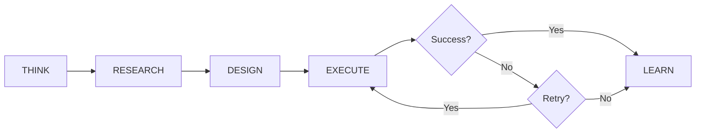

# MetaAgent

The core intelligent agent for text-to-SQL conversion.

---

## Class Definition

```python
class MetaAgent:
    """
    META-LEARNING AGENT - PURE INTELLIGENCE

    This agent:
    1. THINKS - Analyzes each problem uniquely
    2. RESEARCHES - Finds what worked for similar problems
    3. DESIGNS - Creates custom approach (dynamic prompts!)
    4. EXECUTES - Runs with intelligent error recovery
    5. LEARNS - Updates knowledge from EVERY interaction
    """
```

---

## Constructor

<div class="api-method" markdown>

```python
MetaAgent(
    llm_client: LLMClient,
    storage_path: Optional[Path] = None,
)
```

</div>

### Parameters

| Parameter | Type | Required | Default | Description |
|-----------|------|----------|---------|-------------|
| `llm_client` | `LLMClient` | Yes | - | LLM client instance (Azure, OpenAI, Anthropic) |
| `storage_path` | `Path` | No | `~/.vanna/meta_agent.json` | Path for knowledge persistence |

### Example

```python
from src.intelligence.meta_agent import MetaAgent
from src.llm.azure_openai_client import AzureOpenAIClient, AzureOpenAIConfig
from pathlib import Path

# With default storage
agent = MetaAgent(llm_client=llm)

# With custom storage path
agent = MetaAgent(
    llm_client=llm,
    storage_path=Path("./my_knowledge.json"),
)
```

---

## Methods

### connect()

<div class="api-method" markdown>

```python
async def connect(
    db_executor: Callable,
    driver: Optional[str] = None,
) -> Dict
```

</div>

Connect to a database and auto-discover schema and dialect.

#### Parameters

| Parameter | Type | Required | Default | Description |
|-----------|------|----------|---------|-------------|
| `db_executor` | `Callable` | Yes | - | Async function to execute SQL queries |
| `driver` | `str` | No | `None` | Hint for database driver |

#### Returns

```python
{
    "dialect": str,           # "mssql", "postgresql", "mysql", "sqlite"
    "tables": int,            # Number of tables discovered
    "schema_insights": int,   # Number of LLM-generated insights
}
```

#### Example

```python
stats = await agent.connect(db_executor=db.execute)

print(f"Dialect: {stats['dialect']}")
print(f"Tables: {stats['tables']}")
print(f"Insights: {stats['schema_insights']}")
```

#### What Happens

1. **Probe Database** - Runs test queries to detect dialect
2. **Discover Schema** - Queries `INFORMATION_SCHEMA` for tables/columns
3. **Analyze Schema** - LLM generates insights about relationships
4. **Store Learnings** - Persists dialect and schema knowledge

---

### query()

<div class="api-method" markdown>

```python
async def query(
    question: str,
) -> Dict
```

</div>

Process a natural language question and return SQL results.

#### Parameters

| Parameter | Type | Required | Description |
|-----------|------|----------|-------------|
| `question` | `str` | Yes | Natural language question |

#### Returns

```python
{
    "success": bool,            # Whether query succeeded
    "sql": str,                 # Generated SQL query
    "data": List[Dict],         # Query results
    "row_count": int,           # Number of rows returned
    "iterations": int,          # Self-correction attempts (1-4)
    "problem_type": str,        # LLM-classified problem type
    "execution_time_ms": float, # Total execution time
    "error": Optional[str],     # Error message if failed
    "steps_taken": int,         # Processing steps
}
```

#### Example

```python
result = await agent.query("How many orders last month?")

if result["success"]:
    print(f"SQL: {result['sql']}")
    print(f"Data: {result['data']}")
    print(f"Iterations: {result['iterations']}")
else:
    print(f"Error: {result['error']}")
```

#### Processing Flow



---

### auto_learn()

<div class="api-method" markdown>

```python
async def auto_learn(
    intensity: str = "medium",
) -> Dict
```

</div>

Self-train on the connected database.

#### Parameters

| Parameter | Type | Required | Default | Description |
|-----------|------|----------|---------|-------------|
| `intensity` | `str` | No | `"medium"` | Training intensity level |

#### Intensity Levels

| Level | Multiplier | Use Case |
|-------|------------|----------|
| `light` | 0.3× | Quick validation |
| `medium` | 0.6× | Balanced coverage |
| `heavy` | 1.0× | Comprehensive |
| `exhaustive` | 1.5× | Deep training |

#### Question Calculation

Questions are calculated dynamically based on schema:

```
(tables × 2) + (columns ÷ 10) + (relationships ÷ 3) × multiplier
```

| Database | Tables | Columns | Light | Medium | Heavy |
|----------|--------|---------|-------|--------|-------|
| Tiny | 2 | 4 | 3 | 3 | 5 |
| Small | 5 | 17 | 4 | 8 | 14 |
| Medium | 15 | 68 | 13 | 27 | 45 |
| Large | 40 | 334 | 39 | 78 | 100 |

!!! info "Bounds"
    - Minimum: 3 questions
    - Maximum: 100 questions

#### Returns

```python
{
    "domain": str,              # Detected domain ("ecommerce", "healthcare", etc.)
    "questions_generated": int, # Questions created by LLM
    "questions_tested": int,    # Questions actually tested
    "successes": int,           # Successful queries
    "failures": int,            # Failed queries
    "success_rate": float,      # 0.0 to 1.0
    "learnings": List[Dict],    # What was learned from failures
    "schema_stats": {
        "tables": int,
        "total_columns": int,
    },
    "target_questions": int,    # Calculated question count
    "intensity": str,           # Requested intensity
}
```

#### Example

```python
results = await agent.auto_learn(intensity="medium")

print(f"Domain: {results['domain']}")
print(f"Questions: {results['questions_tested']}")
print(f"Success rate: {results['success_rate']*100:.0f}%")
print(f"Schema: {results['schema_stats']}")
```

---

### get_stats()

<div class="api-method" markdown>

```python
def get_stats() -> Dict
```

</div>

Get current knowledge statistics.

#### Returns

```python
{
    "dialect": str,               # Current SQL dialect
    "tables": int,                # Tables in schema
    "problem_types_learned": int, # Unique problem types
    "actions_learned": int,       # Fix strategies stored
    "solutions_stored": int,      # Successful solutions
    "failures_analyzed": int,     # Analyzed failures
    "dialect_learnings": int,     # Dialect-specific learnings
    "schema_insights": int,       # Schema insights
}
```

#### Example

```python
stats = agent.get_stats()

print(f"Dialect: {stats['dialect']}")
print(f"Solutions: {stats['solutions_stored']}")
print(f"Insights: {stats['schema_insights']}")
```

---

## Knowledge Structure

The agent stores learned knowledge in `MetaKnowledge`:

```python
@dataclass
class MetaKnowledge:
    # Successful patterns
    successful_solutions: List[LearnedSolution]

    # Failure analysis
    failed_attempts: List[LearnedFailure]

    # Dialect-specific learnings
    dialect_learnings: List[str]

    # Schema insights
    schema_insights: List[str]

    # Fix strategies
    fix_strategies: List[Dict]

    # TRUE LEARNING - Applied corrections
    name_corrections: Dict[str, str]      # {"categorie": "categories"}
    table_relationships: Dict[str, str]   # {"products": "product_items"}
    column_mappings: Dict[str, str]       # {"revenue": "total_amount"}
```

---

## Complete Example

```python
import asyncio
from src.intelligence.meta_agent import MetaAgent
from src.llm.azure_openai_client import AzureOpenAIClient, AzureOpenAIConfig
from src.database.multi_db import MSSQLAdapter, ConnectionConfig, DatabaseType

async def main():
    # Setup LLM
    llm = AzureOpenAIClient(AzureOpenAIConfig(
        api_key="your-key",
        azure_endpoint="https://your-endpoint.openai.azure.com",
        azure_deployment="gpt-4o",
    ))

    # Create agent
    agent = MetaAgent(llm_client=llm)

    # Connect to database
    db = MSSQLAdapter(ConnectionConfig(
        name="mydb",
        db_type=DatabaseType.MSSQL,
        host="localhost",
        database="MyDB",
        username="user",
        password="pass",
    ))
    await db.connect()

    # Connect agent
    stats = await agent.connect(db_executor=db.execute)
    print(f"Connected: {stats}")

    # Auto-train
    learn_results = await agent.auto_learn(intensity="light")
    print(f"Trained: {learn_results['success_rate']*100:.0f}%")

    # Query
    result = await agent.query("Show top 10 customers")
    print(f"SQL: {result['sql']}")
    print(f"Data: {result['data']}")

    # Check stats
    final_stats = agent.get_stats()
    print(f"Solutions learned: {final_stats['solutions_stored']}")

asyncio.run(main())
```
