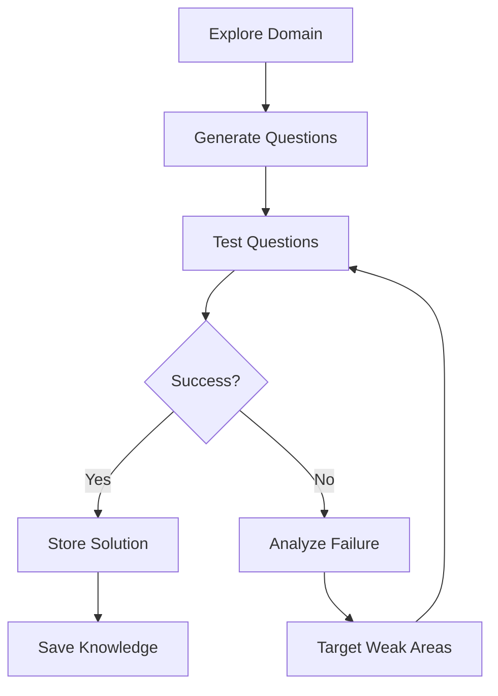

# Auto-Learning

Self-training on your database.

---

## Overview

The `auto_learn()` method trains the agent automatically:

1. **Explores domain** - Understands what the database is about
2. **Generates questions** - Creates test questions for your data
3. **Tests questions** - Runs queries and learns from results
4. **Targets weak areas** - Improves where it failed

```python
results = await agent.auto_learn(intensity="medium")
```

---

## Dynamic Question Calculation

Questions are calculated based on your database complexity:

```
Formula: (tables × 2) + (columns ÷ 10) + (relationships ÷ 3) × multiplier
```

### Intensity Levels

| Level | Multiplier | Use Case |
|-------|------------|----------|
| `light` | 0.3× | Quick validation |
| `medium` | 0.6× | Balanced coverage |
| `heavy` | 1.0× | Comprehensive |
| `exhaustive` | 1.5× | Deep training |

### Example Calculations

| Database | Tables | Columns | Light | Medium | Heavy |
|----------|--------|---------|-------|--------|-------|
| Tiny | 2 | 4 | 3 | 3 | 5 |
| Small | 5 | 17 | 4 | 8 | 14 |
| Medium | 15 | 68 | 13 | 27 | 45 |
| Large | 40 | 334 | 39 | 78 | 100 |
| Very Large | 80 | 880 | 82 | 100 | 100 |

!!! info "Bounds"
    - **Minimum**: 3 questions
    - **Maximum**: 100 questions

---

## Learning Process



### Step 1: Explore Domain

```python
# LLM analyzes schema
domain = await agent._llm_explore_domain()
# {
#     "domain": "ecommerce",
#     "entities": "customers, orders, products",
#     "relationships": "orders → customers",
# }
```

### Step 2: Generate Questions

The LLM generates diverse questions:

- Simple counts ("How many X?")
- Listings ("Show all X")
- Filtering ("Find X where Y")
- Aggregations ("Total/Average of X")
- Rankings ("Top 10 X by Y")
- Joins ("X with their Y")

### Step 3: Test & Learn

```python
for question in questions:
    result = await agent.query(question)

    if result["success"]:
        # Store successful pattern
        store_solution(question, result["sql"])
    else:
        # Analyze failure
        learn_from_failure(question, result["error"])
```

### Step 4: Target Weak Areas

If failures occur, the agent generates simpler questions to learn the correct patterns.

---

## Results

```python
results = await agent.auto_learn(intensity="medium")

print(f"Domain: {results['domain']}")
print(f"Questions: {results['questions_tested']}")
print(f"Success rate: {results['success_rate']*100:.0f}%")
```

### Return Structure

```python
{
    "domain": "ecommerce",
    "questions_generated": 27,
    "questions_tested": 27,
    "successes": 25,
    "failures": 2,
    "success_rate": 0.926,
    "learnings": [...],
    "schema_stats": {
        "tables": 15,
        "total_columns": 68,
    },
    "target_questions": 27,
    "intensity": "medium",
}
```

---

## What Gets Learned

| Category | Example |
|----------|---------|
| Successful SQL | `SELECT COUNT(*) FROM users` |
| Error patterns | `LIMIT doesn't work in MSSQL` |
| Name corrections | `"categories" → "Category"` |
| Table mappings | `"products" → "product_items"` |
| Fix strategies | `TRY_CAST for conversion errors` |
