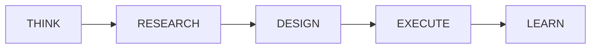

# Query Processing

How the agent processes natural language queries.

---

## The THINK-RESEARCH-DESIGN-EXECUTE-LEARN Loop

Every query goes through 5 phases:



---

## Phase 1: THINK

Analyze the question and classify the problem.

```python
# LLM analyzes:
# - What is being asked?
# - What entities are involved?
# - What operations are needed?
# - What might be challenging?
```

**Output:**
```python
{
    "type": "aggregation_with_filter",
    "entities": ["orders", "customers"],
    "operations": ["COUNT", "GROUP BY", "WHERE"],
}
```

---

## Phase 2: RESEARCH

Find similar problems that worked before.

```python
# Search knowledge base:
# - Similar successful solutions
# - Relevant failures to avoid
# - Fix strategies that worked
```

**Uses:**
- `successful_solutions` - What SQL worked
- `failed_attempts` - What to avoid
- `fix_strategies` - How to fix errors

---

## Phase 3: DESIGN

Create a dynamic, custom prompt for THIS specific problem.

```python
# The prompt includes:
# - Problem analysis
# - Schema context
# - Similar examples
# - Failures to avoid
# - Name corrections
# - Dialect specifics
```

!!! important "Dynamic Prompts"
    No fixed templates. Every prompt is generated based on the specific problem and learned knowledge.

---

## Phase 4: EXECUTE

Run the SQL with intelligent error handling.

```python
for iteration in range(4):
    try:
        data = await db_executor(sql)
        return {"success": True, "data": data}
    except Exception as e:
        sql = await self._llm_fix_error(sql, error)
```

**Self-Correction:**
- Up to 4 attempts
- LLM analyzes error
- Searches for correct names
- Applies learned fixes

---

## Phase 5: LEARN

Store the outcome for future queries.

=== "On Success"

    ```python
    # Store successful solution
    knowledge.successful_solutions.append({
        "question": question,
        "sql": sql,
        "problem_type": problem_type,
    })

    # If corrections worked, store fix strategy
    if iterations > 1:
        knowledge.fix_strategies.append({
            "error_type": error,
            "strategy": fix_applied,
            "worked": True,
        })
    ```

=== "On Failure"

    ```python
    # Analyze failure
    analysis = await llm.analyze_failure(question, error)

    # Extract name corrections
    if "invalid object" in error:
        wrong_name = extract_wrong_name(error)
        correct_name = search_database(wrong_name)
        knowledge.name_corrections[wrong_name] = correct_name

    # Store for future reference
    knowledge.failed_attempts.append({
        "question": question,
        "error": error,
        "analysis": analysis,
    })
    ```

---

## Example Flow

**Question:** "How many orders per customer?"

```
┌─────────────────────────────────────────────────────────────┐
│ THINK                                                        │
│ Type: aggregation                                           │
│ Entities: orders, customers                                 │
│ Operations: COUNT, GROUP BY                                 │
└─────────────────────────────────────────────────────────────┘
                              │
                              ▼
┌─────────────────────────────────────────────────────────────┐
│ RESEARCH                                                     │
│ Found: "orders by user" → SELECT user_id, COUNT(*)          │
│ Avoid: LIMIT syntax (this is MSSQL)                         │
└─────────────────────────────────────────────────────────────┘
                              │
                              ▼
┌─────────────────────────────────────────────────────────────┐
│ DESIGN                                                       │
│ Apply: name_corrections["customer"] → "customer_id"         │
│ Apply: dialect = MSSQL (use TOP not LIMIT)                  │
│ Generate: Dynamic prompt with all context                    │
└─────────────────────────────────────────────────────────────┘
                              │
                              ▼
┌─────────────────────────────────────────────────────────────┐
│ EXECUTE                                                      │
│ SQL: SELECT customer_id, COUNT(*) as order_count            │
│      FROM orders GROUP BY customer_id                        │
│ Result: [{"customer_id": 1, "order_count": 5}, ...]         │
└─────────────────────────────────────────────────────────────┘
                              │
                              ▼
┌─────────────────────────────────────────────────────────────┐
│ LEARN                                                        │
│ Store: successful_solutions.append(...)                      │
│ Save: ~/.vanna/meta_agent.json                              │
└─────────────────────────────────────────────────────────────┘
```
