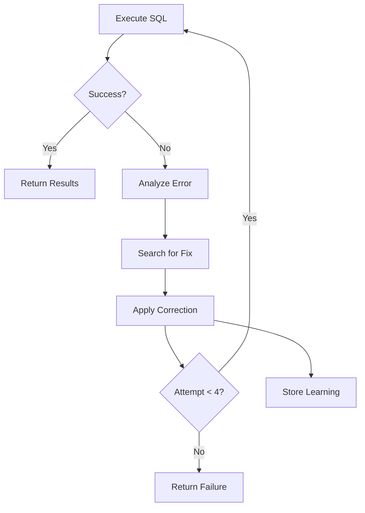

# Self-Healing

How the agent automatically fixes errors.

---

## Overview

When SQL execution fails, the agent:

1. **Analyzes the error** with LLM
2. **Searches database** for correct names
3. **Learns corrections** for future queries
4. **Retries** with fixed SQL (up to 4 attempts)

---

## Error Handling Flow



---

## Name Correction

When an "invalid object name" error occurs:

```python
# Error: "Invalid object name 'Categories'"

# Step 1: Extract wrong name
wrong_name = "Categories"

# Step 2: Search database for correct name
all_tables = await db.execute("SELECT TABLE_NAME FROM INFORMATION_SCHEMA.TABLES")

# Step 3: LLM finds correct name
correct_name = "Category"  # LLM matches by similarity

# Step 4: Store correction
knowledge.name_corrections["categories"] = "Category"
```

**Next time:**
```python
# Query: "Show all categories"
# Agent applies correction BEFORE generating SQL
# → "SELECT * FROM Category" (correct!)
```

---

## Table Relationship Learning

When a query fails because the wrong table was used:

```python
# Failed SQL: SELECT category FROM Products
# Error: "Invalid column name 'category'"

# LLM analyzes:
# - Question asked about "categories"
# - Products table doesn't have category column
# - Categories are in the "Category" table

# Store learning:
knowledge.table_relationships["categories"] = "Category"
```

---

## Fix Strategies

The agent learns which fixes work:

| Error Type | Strategy | Example |
|------------|----------|---------|
| Invalid object | Search for correct name | `"Categories" → "Category"` |
| Conversion error | Use TRY_CAST | `TRY_CAST(col AS INT)` |
| NULL issues | Add ISNULL | `ISNULL(col, 0)` |
| Syntax error | Dialect-specific fix | `TOP` vs `LIMIT` |

---

## Retry Logic

```python
for iteration in range(4):
    try:
        data = await db_executor(sql)
        return {"success": True, "iterations": iteration + 1}

    except Exception as e:
        if iteration < 3:
            # Different strategy each attempt
            if iteration == 0:
                strategy = "Fix syntax directly"
            elif iteration == 1:
                strategy = "Use type conversion"
            elif iteration == 2:
                strategy = "Filter problematic data"
            else:
                strategy = "Completely rethink approach"

            sql = await llm_fix_error(sql, error, strategy)
```

---

## Example: Self-Healing in Action

**Question:** "Show category sales"

**Attempt 1:**
```sql
SELECT * FROM Categories
-- Error: Invalid object name 'Categories'
```

**Agent learns:** `Categories → Category`

**Attempt 2:**
```sql
SELECT * FROM Category
-- Success!
```

**Future queries:**
```sql
-- "Show categories" → automatically uses "Category"
SELECT * FROM Category
```

---

## What Gets Learned

| Learning Type | Storage | Example |
|---------------|---------|---------|
| Name corrections | `name_corrections` | `{"categorie": "Category"}` |
| Table mappings | `table_relationships` | `{"products": "ProductItems"}` |
| Column mappings | `column_mappings` | `{"revenue": "TotalAmount"}` |
| Fix strategies | `fix_strategies` | `{"conversion": "TRY_CAST"}` |
| Dialect rules | `dialect_learnings` | `"Use TOP not LIMIT"` |
