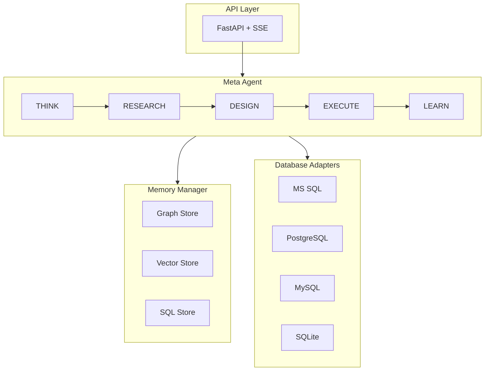

---
hide:
  - navigation
  - toc
---

<div class="hero" markdown>

# Agentic SQL

**Pure LLM Intelligence for Text-to-SQL**

[](https://www.python.org/downloads/)
[](https://opensource.org/licenses/MIT)
[](https://github.com/bharatmohanthakur/Agentic-sql)

[Get Started](getting-started/installation.md){ .md-button .md-button--primary }
[View on GitHub](https://github.com/bharatmohanthakur/Agentic-sql){ .md-button }

</div>

---

## What is Agentic SQL?

Agentic SQL is a **truly intelligent** Text-to-SQL framework that:

- Works on **ANY database** without configuration
- Has **ZERO hardcoded rules** - everything is learned
- **Auto-discovers** schema and SQL dialect
- **Self-heals** when errors occur
- **Learns** from every interaction

```python
# That's all you need
agent = MetaAgent(llm_client=llm)
await agent.connect(db_executor=db.execute)
result = await agent.query("How many orders last month?")
```

---

## Key Features

<div class="feature-grid" markdown>

<div class="feature-card" markdown>
### :material-magnify: Auto-Discovery
Automatically detects SQL dialect, discovers schema, identifies relationships, and learns naming conventions.
</div>

<div class="feature-card" markdown>
### :material-brain: Auto-Learning
Self-trains on your database. Question count dynamically calculated based on schema complexity.
</div>

<div class="feature-card" markdown>
### :material-wrench: Self-Healing
Analyzes errors, searches for correct names, learns corrections, and retries automatically.
</div>

<div class="feature-card" markdown>
### :material-database: Multi-Database
Works with MS SQL Server, PostgreSQL, MySQL, SQLite, and more. Same API for all.
</div>

<div class="feature-card" markdown>
### :material-memory: Persistent Memory
Hybrid memory with Graph + Vector + SQL stores. Never makes the same mistake twice.
</div>

<div class="feature-card" markdown>
### :material-robot: Multi-Agent
Build complex workflows with SQL, Analyst, and Validator agents.
</div>

</div>

---

## Quick Example

=== "Basic Query"

    ```python
    import asyncio
    from src.intelligence.meta_agent import MetaAgent
    from src.llm.azure_openai_client import AzureOpenAIClient, AzureOpenAIConfig

    async def main():
        # Setup LLM
        llm = AzureOpenAIClient(AzureOpenAIConfig(
            api_key="your-key",
            azure_endpoint="https://your-endpoint.openai.azure.com",
            azure_deployment="gpt-4o",
        ))

        # Create agent
        agent = MetaAgent(llm_client=llm)

        # Connect (auto-discovers everything!)
        await agent.connect(db_executor=db.execute)

        # Query naturally
        result = await agent.query("Show top 10 customers by revenue")

        print(f"SQL: {result['sql']}")
        print(f"Data: {result['data']}")

    asyncio.run(main())
    ```

=== "With Auto-Learning"

    ```python
    # Connect to database
    await agent.connect(db_executor=db.execute)

    # Auto-train (questions based on schema complexity)
    results = await agent.auto_learn(intensity="medium")

    print(f"Domain: {results['domain']}")
    print(f"Success rate: {results['success_rate']*100:.0f}%")

    # Now queries use learned knowledge
    result = await agent.query("Which products are low in stock?")
    ```

=== "API Server"

    ```python
    from src.api.server import create_app, APIConfig

    app = create_app(
        config=APIConfig(host="0.0.0.0", port=8000),
        sql_agent=agent,
    )

    # Run: uvicorn main:app
    ```

    ```bash
    curl -X POST http://localhost:8000/query \
      -H "Content-Type: application/json" \
      -d '{"question": "How many users?"}'
    ```

---

## Architecture



---

## Supported Databases

| Database | Status | Auto-Detected Features |
|----------|--------|------------------------|
| MS SQL Server | :material-check-circle:{ .status-ready } Ready | TOP, GETDATE, T-SQL |
| PostgreSQL | :material-check-circle:{ .status-ready } Ready | LIMIT, NOW(), PL/pgSQL |
| MySQL | :material-check-circle:{ .status-ready } Ready | LIMIT, backticks |
| SQLite | :material-check-circle:{ .status-ready } Ready | LIMIT, datetime |
| Snowflake | :material-clock:{ .status-coming } Coming | Warehouse syntax |
| BigQuery | :material-clock:{ .status-coming } Coming | Standard SQL |

---

## Test Results

| Test Category | Queries | Success Rate |
|---------------|---------|--------------|
| Simple Queries | 3 | 100% |
| Date Queries | 4 | 100% |
| Aggregations | 3 | 100% |
| Complex Joins | 3 | 100% |
| Window Functions | 3 | 100% |
| **Total** | **23** | **100%** |

---

<div style="text-align: center; margin-top: 3rem;" markdown>

[Get Started :material-arrow-right:](getting-started/installation.md){ .md-button .md-button--primary }

</div>
