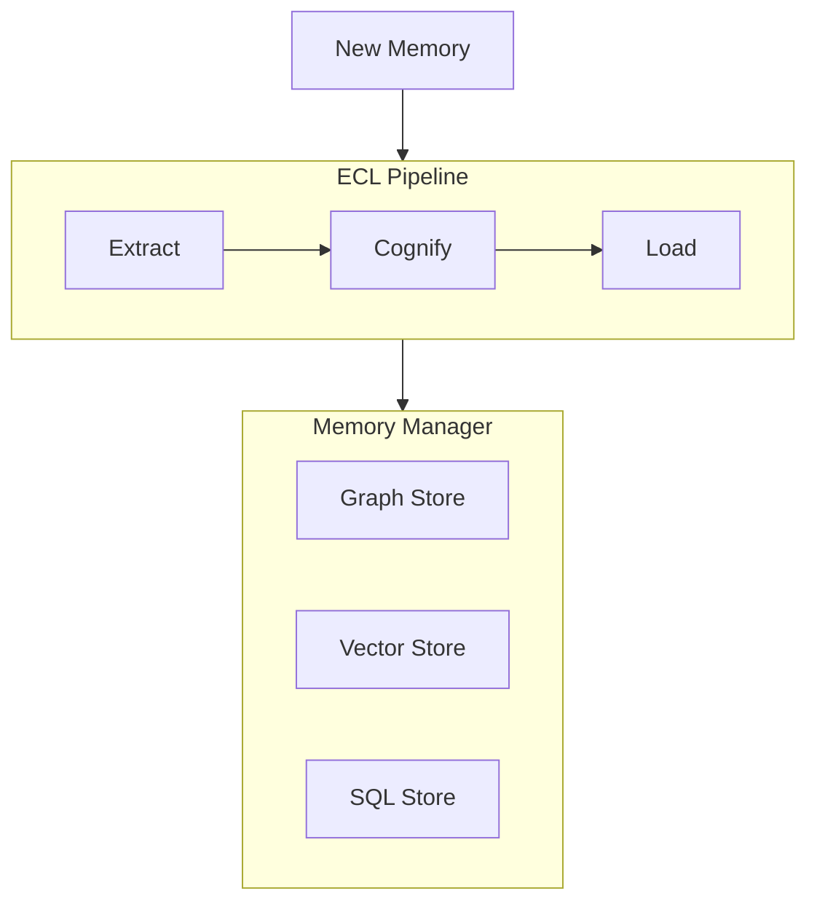

# Memory Architecture

Hybrid memory system for intelligent knowledge management.

---

## Overview



---

## Three Storage Backends

| Store | Purpose | Data |
|-------|---------|------|
| **Graph** | Entity relationships | Nodes, edges, traversal |
| **Vector** | Semantic similarity | Embeddings, cosine distance |
| **SQL** | Structured persistence | Tables, queries |

---

## Memory Hierarchy

```
┌─────────────────────────────────────┐
│  SESSION  │ Current conversation    │
├─────────────────────────────────────┤
│  USER     │ User-specific prefs     │
├─────────────────────────────────────┤
│  ENTITY   │ Facts about entities    │
├─────────────────────────────────────┤
│  GLOBAL   │ Shared knowledge        │
└─────────────────────────────────────┘
```

Higher levels override lower levels during retrieval.
