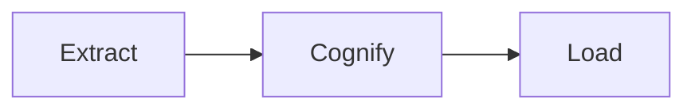

# ECL Pipeline

Extract, Cognify, Load - the memory processing pipeline.

---

## Pipeline Stages



---

## Extract

Parse raw content and prepare for processing.

```python
memory = await manager.add(
    content="SELECT * FROM users",
    memory_type=MemoryType.QUERY_PATTERN,
)
```

- Parse content
- Extract metadata
- Deduplication check

---

## Cognify

Transform into structured knowledge.

```python
memory = await manager.cognify(memory)
```

- Generate embeddings
- Extract entities
- Find relationships

---

## Load

Persist to storage backends.

```python
await manager.store(memory)
```

- Store in Graph (relationships)
- Store in Vector (embeddings)
- Store in SQL (persistence)

---

## Complete Pipeline

```python
# Run all stages automatically
memory = await manager.ingest(
    content="SELECT COUNT(*) FROM users",
    memory_type=MemoryType.QUERY_PATTERN,
)
```
